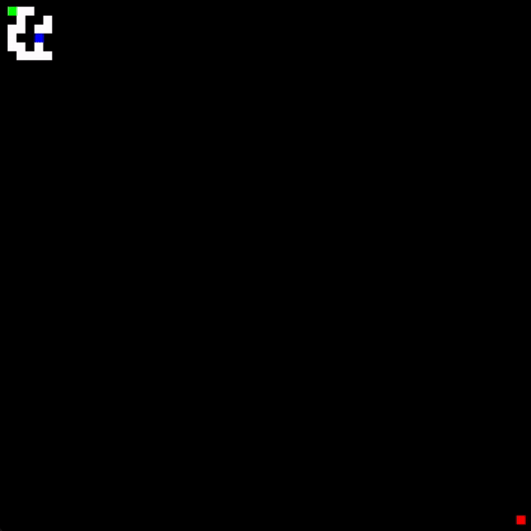
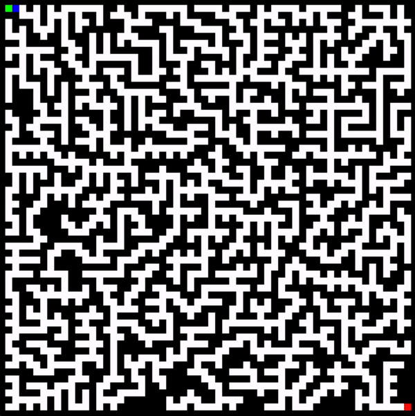

# 🔎 Maze Builder And Solver

This project allows you to generate a maze and solve it.

## Generation



## Solver



## How does the generation work?

A character starts at the starting point and advances randomly by breaking through walls. It can only break through if it doesn't create a new path between two existing paths (this ensures a unique solution to the maze). It continues like this until it reaches the exit.

If it doesn't break through any new walls for a certain period, it gets teleported to another location on the map without walls and continues.

## How does the solver work?

The solver uses the text file created by the generator. It starts from the initial point and then calculates a path to the exit using the [A* search algorithm](https://en.wikipedia.org/wiki/A*_search_algorithm).

## Prerequisites

Before running the project, make sure you have the following dependencies installed:

- Python
- Necessary Python libraries (you can install them using `pip`):
  - [Pygame](https://www.pygame.org/)

## Running the Project

1. Clone this repository to your computer:

   ```bash
   git clone https://github.com/corederu/ai-playing-snake.git

2. Run `generateMaze.py` to generate the maze:

   ```bash
   python3 generateMaze.py
   ```

   This will create a file named 'maze.txt' and a file named 'maze.png' representing the generated maze.

3. Run `aStarSolver.py` to solve the maze:

   ```bash
   python3 aStarSolver.py
   ```
    This will solve the maze and create a file named 'mazeSolve.png' containing an image of the solution found.